# PawPal+ (Module 2 Project)

You are building **PawPal+**, a Streamlit app that helps a pet owner plan care tasks for their pet.

## Scenario

A busy pet owner needs help staying consistent with pet care. They want an assistant that can:

- Track pet care tasks (walks, feeding, meds, enrichment, grooming, etc.)
- Consider constraints (time available, priority, owner preferences)
- Produce a daily plan and explain why it chose that plan

Your job is to design the system first (UML), then implement the logic in Python, then connect it to the Streamlit UI.

## ✨ Features

What PawPal+ actually does, and the algorithm behind each one (all in
[`pawpal_system.py`](pawpal_system.py)):

**Scheduling & sorting**
- **Sorting by time** — a day's tasks are returned as a chronological timeline via
  a stable sort keyed on `datetime.time` (`O(n log n)` Timsort, no string parsing).
- **Priority tie-breaking** — when two tasks share a time, the sort key `(time,
  -priority)` floats the higher-`Priority` one (e.g. medication) to the top.
- **Free-slot finder** — sweeps a day's busy intervals in order and returns the
  first gap big enough for a new task within the owner's waking window.

**Recurring tasks**
- **Daily / weekly / every-N-days recurrence** — `Task.occurs_on(day)` decides if a
  task lands on a date: weekly matches the weekday, every-N-days uses modular
  arithmetic `(day - start).days % interval == 0`, all bounded by `date`/`end_date`.
- **Auto roll-over on completion** — completing a recurring task spawns its next
  occurrence with `datetime.timedelta`, so month/year boundaries are correct
  (Jul 31 → Aug 1). It's idempotent (never double-spawns) and stops at `end_date`.
- **Per-day completion** — completion is stored as a *set of dates* (`completed_on`),
  so a daily task done today is still pending tomorrow (and can be un-ticked).

**Conflict detection**
- **Conflict warnings** — a non-blocking, human-readable message naming each
  clashing task, its time, and its pet; returns `None` when clear (never raises).
- **Overlap test** — two tasks collide only if they *share a calendar day* AND their
  time intervals overlap (half-open math, so back-to-back tasks don't clash).
- **Whole-day conflict audit** — `conflicts_on(day)` finds every overlapping pair
  with a sweep line (keep only still-"open" tasks), `O(n log n)` instead of `O(n²)`.
- **Cross-pet awareness** — conflicts are checked across *all* pets, since one owner
  can't be in two places at once.

**Planning insights & views**
- **Filtering** — `filter_tasks()` narrows by pet, by per-day completion status, or both.
- **Next up & overdue** — `next_task()` scans forward (up to a year) for the soonest
  unfinished task; `overdue_tasks()` flags today's past-due, not-yet-done items.
- **Daily workload** — `daily_load()` totals scheduled minutes per pet at a glance.
- **Attribute-driven suggestions** — `suggest_tasks()` proposes a starter routine from
  a pet's flags (dog → walk, meds/illness → HIGH-priority reminders; none if retired).

## What you will build

Your final app should:

- Let a user enter basic owner + pet info
- Let a user add/edit tasks (duration + priority at minimum)
- Generate a daily schedule/plan based on constraints and priorities
- Display the plan clearly (and ideally explain the reasoning)
- Include tests for the most important scheduling behaviors

## Getting started

### Setup

```bash
python -m venv .venv
source .venv/bin/activate  # Windows: .venv\Scripts\activate
pip install -r requirements.txt
```

### Suggested workflow

1. Read the scenario carefully and identify requirements and edge cases.
2. Draft a UML diagram (classes, attributes, methods, relationships).
3. Convert UML into Python class stubs (no logic yet).
4. Implement scheduling logic in small increments.
5. Add tests to verify key behaviors.
6. Connect your logic to the Streamlit UI in `app.py`.
7. Refine UML so it matches what you actually built.

## 🖥️ Sample Output

Paste a sample of your app's CLI or Streamlit output here so a reader can see what a generated plan looks like:

```
===== Today's Schedule (Saturday, July 04, 2026) =====
  [ ] 07:30  Morning walk (dog, 30 min, daily)
  [ ] 09:00  Give allergy meds (cat, 5 min, daily)
  [ ] 18:00  Evening feeding (cat, 15 min, daily)
===============================================

...marked 'Morning walk' as completed...

===== Today's Schedule (Saturday, July 04, 2026) =====
  [x] 07:30  Morning walk (dog, 30 min, daily)
  [ ] 09:00  Give allergy meds (cat, 5 min, daily)
  [ ] 18:00  Evening feeding (cat, 15 min, daily)
===============================================
```

```
# e.g.:
# Daily plan for Biscuit (Golden Retriever):
#   08:00 — Morning walk (30 min) [priority: high]
#   09:00 — Feeding (10 min) [priority: high]
#   ...
```

## 🧪 Testing PawPal+

```bash
# Run the full test suite:
pytest

# Run with coverage:
pytest --cov
```

Sample test output:

```
# Paste your pytest output here
```

## 📐 Class Diagram

The final architecture (rendered live by GitHub from the Mermaid source in
[`diagrams/uml_final.mmd`](diagrams/uml_final.mmd)). Each `Pet` owns its own
tasks, and the `Scheduler` operates *over* the `Owner` rather than storing tasks
itself — so the pets stay the single source of truth.

```mermaid
classDiagram
    class Frequency {
        <<enumeration>>
        ONCE
        DAILY
        WEEKLY
        EVERY_N_DAYS
    }

    class Priority {
        <<enumeration>>
        LOW
        NORMAL
        HIGH
    }

    class Owner {
        +str name
        +str occupation
        +List~Pet~ pets
        +add_pet(Pet) void
        +retire_pet(Pet) void
        +all_tasks() List~Task~
        +pet_of(int task_id) Pet
    }

    class Pet {
        +str name
        +str type
        +str gender
        +float height
        +float weight
        +bool has_illness
        +bool takes_meds
        +bool retired
        +List~Task~ tasks
        +add_task(Task) void
        +remove_task(int task_id) void
        +get_task(int task_id) Task
        +retire() void
    }

    class Task {
        +str description
        +date date
        +time time
        +int duration
        +Frequency frequency
        +Priority priority
        +int interval
        +date end_date
        +Set~date~ completed_on
        +int id
        +is_recurring() bool
        +is_done_on(date) bool
        +occurs_on(date) bool
        +next_occurrence(date) Task
        +overlaps(Task) bool
    }

    class Scheduler {
        +Owner owner
        +all_tasks() List~Task~
        +schedule_task(Pet, Task) List~Task~
        +find_conflicts(Task) List~Task~
        +conflict_warning(Task) str
        +tasks_for_day(date) List~Task~
        +tasks_for_today() List~Task~
        +sort_by_time(List~Task~) List~Task~
        +filter_tasks(str, bool, date) List~Task~
        +find_free_slot(date, int) time
        +suggest_tasks(Pet) List~Task~
        +get_task(int task_id) Task
        +mark_as_completed(int, date) Task
        +mark_as_incomplete(int, date) void
        +remove_task(int) void
        +next_task(datetime) Task
        +overdue_tasks(datetime) List~Task~
        +daily_load(date) Map
        +conflicts_on(date) List~Task~
    }

    Owner "1" *-- "*" Pet : owns
    Pet "1" *-- "*" Task : schedules
    Scheduler "1" --> "1" Owner : operates on
    Task --> Frequency : uses
    Task --> Priority : uses
```



## 📐 Smarter Scheduling

All scheduling logic lives in the `Scheduler` "brain" and the `Task` data class in
[`pawpal_system.py`](pawpal_system.py); the Streamlit UI (`app.py`) and CLI demo
(`main.py`) only call into them. The four core behaviors:

| Feature | Method(s) | Notes |
|---------|-----------|-------|
| **Sorting** | `Scheduler.sort_by_time()`, `Scheduler.tasks_for_day()` | Orders tasks by time of day. |
| **Filtering** | `Scheduler.filter_tasks(pet_name=, completed=, day=)` | Filter by pet and/or completion status. |
| **Conflict detection** | `Scheduler.conflict_warning()`, `find_conflicts()`, `conflicts_on()` | Detects overlapping time slots across pets. |
| **Recurring tasks** | `Task.occurs_on()`, `Task.next_occurrence()`, `Scheduler.mark_as_completed()` | Daily / weekly / every-N-days repetition. |

### Sorting behavior
- **`Scheduler.sort_by_time(tasks=None)`** — returns a task list ordered earliest-first.
  `datetime.time` objects compare directly, so the key is simply `lambda t: t.time`
  (no `"HH:MM"` string parsing needed). O(n log n) via Python's stable sort.
- **`Scheduler.tasks_for_day(day)`** — a day's tasks as a timeline, sorted by
  `(time, -priority)` so that when two tasks share a time, the higher-`Priority`
  one (e.g. medication) sorts first.

### Filtering behavior
- **`Scheduler.filter_tasks(pet_name=None, completed=None, day=None)`** — each filter
  is optional; omit one to skip that check. Because completion is tracked per-day,
  the `completed` flag is evaluated with `Task.is_done_on(day)` (default: today).
  Composes with sorting, e.g. `sort_by_time(filter_tasks(pet_name="Rex"))`.

### Conflict detection logic
- **`Scheduler.conflict_warning(task)`** — the lightweight, non-crashing front door:
  returns a human-readable warning string, or `None` if the task is clear. Never
  raises and never blocks scheduling.
- **`Scheduler.find_conflicts(task)`** — the list of existing tasks that overlap,
  checked across **all** pets (the owner can't be in two places at once).
- **`Scheduler.conflicts_on(day)`** — audits a whole day for every overlapping pair
  using a sweep line (sort by start, keep only still-"open" tasks): O(n log n)
  instead of comparing all n² pairs.
- Underlying checks: `Task.overlaps()` → `_times_overlap()` (interval math on
  start + duration) and `_share_a_day()` (do the two ever land on the same date).
- **`Scheduler.find_free_slot(day, duration)`** — on a conflict, proposes the next
  open gap in the owner's waking window via an interval sweep.

### Recurring task logic
- **`Frequency`** enum: `ONCE`, `DAILY`, `WEEKLY`, `EVERY_N_DAYS` (with `Task.interval`
  and an optional `Task.end_date`).
- **`Task.occurs_on(day)`** — whether a recurring task lands on a given date;
  `EVERY_N_DAYS` uses modular arithmetic `(day - start).days % interval == 0`, and
  the check respects `date`/`end_date` bounds.
- **`Task.next_occurrence(after)`** — builds the next instance using
  `datetime.timedelta` (days=1 / weeks=1 / days=interval) so month/year rollovers
  are correct.
- **`Scheduler.mark_as_completed(id, day)`** — completing a recurring task
  auto-spawns its next occurrence and caps the finished one (`end_date`) so the
  schedule shows exactly one instance per day; idempotent so it never duplicates.

## Testing PawPal+
python -m pytest

### What my tests actually check

I wrote 53 tests in [`tests/test_pawpal.py`](tests/test_pawpal.py). I tried to test each core behavior on its own AND the tricky edge cases I ran into while building, so I grouped them like this:

**Task lifecycle (the basics)**
- Adding a task bumps the pet's task count.
- Marking a task complete flips its status for that day, and you can un-tick it.
- Completion is tracked *per day* — a daily task done today is still pending tomorrow. (This one caught a bug for me early on.)

**Sorting**
- `sort_by_time()` puts tasks in earliest-first order no matter what order I add them.
- `tasks_for_day()` reads like a real timeline (chronological).
- When two tasks are at the same time, the higher **Priority** one (like meds) sorts first.

**Recurrence — does it happen on this day? (`occurs_on` + `Frequency`)**
- Each frequency on its own: ONCE (only its day), DAILY (every day after start), WEEKLY (same weekday), EVERY_N_DAYS (only interval multiples).
- Nothing shows up before the start date, and `end_date` is the last day (inclusive).
- `is_recurring` is True for everything except ONCE (checked all 4 with one parametrized test).
- An interval of 0 or less is rejected when you build the Task.

**Recurrence — making the next one (`next_occurrence` + `mark_as_completed`)**
- Completing a daily/weekly/every-N task spawns the correct next instance; a ONCE task spawns nothing.
- **Month and year rollovers work** (Jul 31 → Aug 1, Dec 31 → Jan 1) because it uses `timedelta`, not just "+1 to the day number".
- The spawned task is a fresh copy: brand-new id, not pre-completed, but it keeps priority/duration/interval/end_date.
- It stops once it passes `end_date`, and completing the same task twice does NOT create a duplicate.

**Conflict detection (`overlaps` / `find_conflicts` / `conflict_warning`)**
- Same day + same time = conflict; two tasks that just *touch* (one ends when the other starts) do NOT conflict.
- Different times or different days don't conflict, and `overlaps` is symmetric (a vs b == b vs a).
- Conflicts are checked across **all pets** (one owner can't be two places at once), and the warning names the clashing task + pet — or returns None when there's no clash.
- Scheduling a task at an already-taken time slot gets flagged.

**Scheduler helpers**
- `find_free_slot()` skips past busy time and gives the first gap that fits.
- `next_task()` returns the soonest upcoming task (skips ones already past) and still finds tasks with long intervals weeks away.
- `overdue_tasks()` flags today's past-due, not-done tasks and clears them when completed.
- `filter_tasks()` by pet name, by completion (per day), and both combined.
- `daily_load()` adds up minutes per pet, and `conflicts_on()` finds every overlapping pair in a day.
- `suggest_tasks()` gives tasks based on the pet's info (dog → walk, meds/illness → HIGH priority) and gives nothing for a retired pet.

```
PS C:\Users\fummy\Documents\Codepath\code_and_labs\PawPal\ai110-module2show-pawpal-starter> python -m pytest
================================================== test session starts ===================================================
platform win32 -- Python 3.13.2, pytest-9.0.3, pluggy-1.6.0
rootdir: C:\Users\fummy\Documents\Codepath\code_and_labs\PawPal\ai110-module2show-pawpal-starter
plugins: anyio-4.13.0
collected 53 items                                                                                                        

tests\test_pawpal.py .....................................................                                          [100%]

=================================================== 53 passed in 0.13s ===================================================

```

I would rate it a 4-star. All 53 tests were passed at first. Only the logic layer is tested. streamlit UI and the CLI is not tested. The share_a_day test only scans 366 days. there's no input validation task for stuff like duration=0 or interval <1


### Bonus owner-facing helpers
| Feature | Method(s) |
|---------|-----------|
| Priority ordering | `Priority` enum + tie-break in `tasks_for_day()` |
| Attribute-driven task suggestions | `Scheduler.suggest_tasks(pet)` |
| Per-day completion / undo | `Task.completed_on`, `Task.is_done_on()`, `mark_as_incomplete()` |
| "Next up" / overdue / workload | `Scheduler.next_task()`, `overdue_tasks()`, `daily_load()` |

## 📸 Demo Walkthrough

Describe your app in numbered steps so a reader can follow along without watching a video:

1. <!-- Describe this step -->
2. <!-- Describe this step -->
3. <!-- Describe this step -->
4. <!-- Describe this step -->
5. <!-- Add more steps as needed -->

**Screenshot or video** *(optional)*: <!-- Insert a screenshot or link to a demo video here -->
